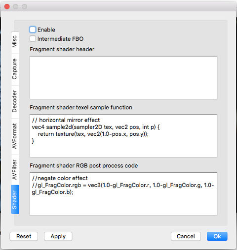

## 1.11.0 Release Note

### Changelog
- Dynamic load QtAVWidgets in VideoOutput. `QtAV::Widgets::registerRenderers()` and `QT += avwidgets` is not requred now.
- D3D11 decoder support. Not stable on Windows phone.
- DXVA refactor and bug fix.
- VA-API: fix memory leak when seeking
- OpenGL:
 * Fix PBO binding
 * Custom shader support (WIP)
 * Edit and apply custom shader when playing. Based on Qt property system.
 * Optimize uniform update
 * GLSL filter support
 * Add `OpenGLVideo.beforeRendering/afterRendering`
- CUDA:
 * Direct copy is default for windows. Now Rendering CUDA decoded frames is faster than any other players
 * 0-copy is default for linux.
 * Use new API (4.0)
- AVPlayer:
 * Add `AVPlayer.stoppedAt` signal
 * add `setTimeRange()`
 * setStart/StopPosition can be called at any time with any value
 * Ensure all threads are running when `started` is emitted
 * Support preload using `load()`. Now no reload in `play()`
- Fix build with QT_NAMESPACE
- Fix swscale color range
- Fix linux install destinations
- Add AVTranscoder.async, encoders are in individual threads
- Add FrameReader class
- Use FFmpeg 3.0 API
- QML:
 * Support filters, including sw filters from libavfilter, and GLSL filter
 * Add `MediaPlayer/Video.audioBackends` property
 * Support autoLoad
 * Add `VideoOutput.mapTo/FromXXX` between source frame and item
 * Video EQ in VideoOutput/Video
 * Add `MediaPlayer.startPosition/stopPotion`
- QMLPlayer: Open video and subtitle at the same time. History view. Zoom. Video EQ

### Custom Shader and GLSL Filters

_VideoShader API is not stable now because I'm lack of shader experience._

A custom `VideoShader` can be used through `OpenGLVideo.setUserShader(VideoShader*)`. You can access `OpenGLVideo` through `VideoRenderer.opengl()` and `GLSLFilter.opengl()`.

`VideoShaderObject` and `DynamicShaderObject` take advantages of QObject meta property and dynamic property features. It's possible to dynamically edit and apply shader code when rendering using `DynamicShaderObject`. `DynamicShaderObject` is also used in QML as `VideoShader` type.

Examples: [shaders](https://github.com/wang-bin/QtAV/tree/master/examples/filters), [glsl filter](https://github.com/wang-bin/QtAV/tree/master/examples/glslfilter)

### QML AudioFilter/VideoFilter

A QML `AudioFilter/VideoFilter` can be type of `AVFilter` and `UserFilter`. `VideoFilter` can also be type of `VideoFilter .GLSLFilter`. `AVFilter` is the default type. The supported filters can be retrieved by `supportedAVFilters` property. The `avfilter` property is avfilter options.

A `VideoFilter` can set a `VideoShader` as it's `shader` property to use custom shader when `GLSLFilter` type is enabled.

A `VideoFilter` can be installed to `MediaPlayer`/`AVPlayer` or `VideoOutput2` as it's target. Only 1 target can be installed to for 1 filter. You can use an array of filters as a filter chain for `MediaPlayer.videoFilters`/`AVPlayer.videoFilters` and `VideoOutput2.filters`

    VideoFilter {
        id: vf
        avfilter: "negate"
        ...
    }
    MediaPlayer {
        ...
        videoFilters: [vf]
    }

Examples: [avfilter](https://github.com/wang-bin/QtAV/tree/master/examples/qml/filter.qml), [glsl filter](https://github.com/wang-bin/QtAV/tree/master/examples/qml/glslfilter.qml)
