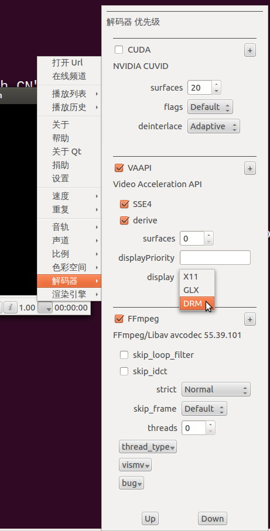
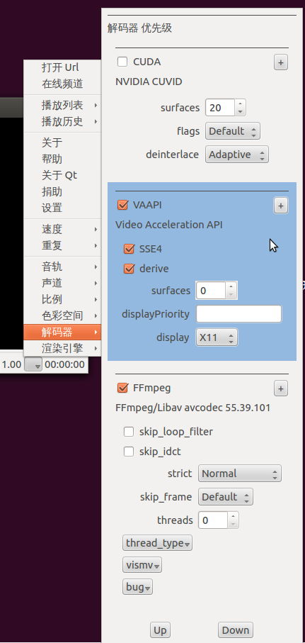
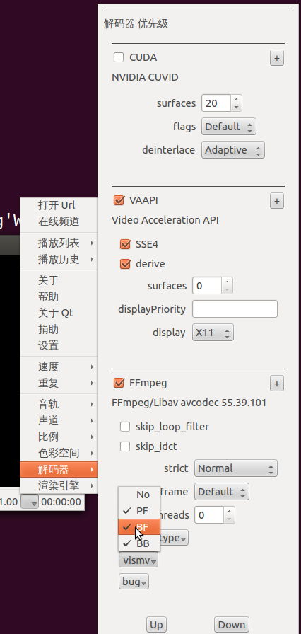
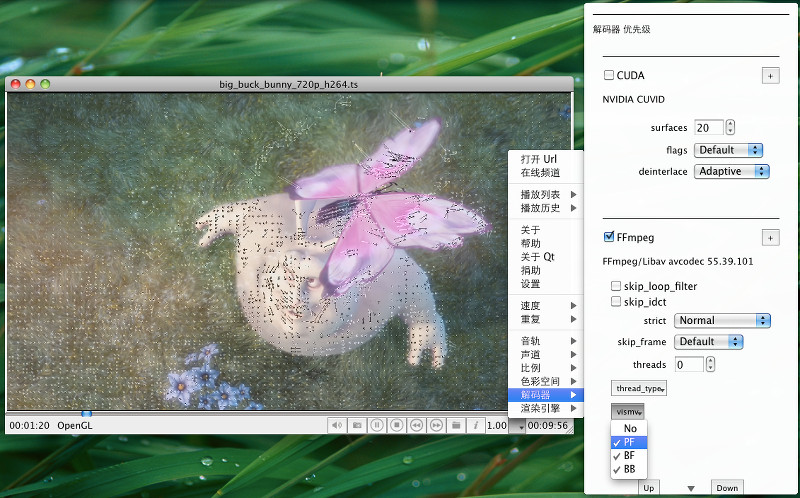

## 1.3.4 Release Note

### brief

- vaapi and dxva support SSE4.1 to copy decoded frame for intel gpu. vaapi was added months ago, but the performance was very poor. With the help of SSE4.1 we have greate performance improvement.
- VAAPI supports drm
- Use latest FFmpeg's hw api
- fix wrong display or crash if change HW decoder
- CUDA: better quality and performance, Fix wrong display order. No Mosaics.
- Add some options for AVCodec and AVFormat as decoder's meta properties.
- Metadata support
- Display aspect ratio use the value in stream if defined. Thank Sandro Cavazzoni
- Support install QtAV as a Qt module
- Fix wrong file name encoding.
- display the image in a music file

### TODO

- Hardware decoding improvement by using direct rendering. I tested VAAPI + GLX without data copy back. The performance is impressive as mpv and xbmc. I tested 3 computers but crashes on 1, and the api is still in plan. So it's not added in this release.

### Guide for Player

 

### Install SDK As a Qt Module

qmake will generate sdk_(un)install.sh(bat) in build dir. You can run install script if you finish the building. Then you can use QtAV as a Qt module very easy. In your project file just add

    CONFIG += av

or in Qt you can use 

    QT += av

Now you can use QtAV api.

Also you should copy ffmpeg and portaudio dll to Qt bin dir.

**NOTE: to build QtAV, uninstall QtAV module first.**