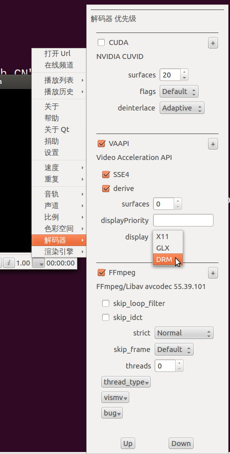

## 1.3.4 Release Note

### Changelog

- vaapi and dxva support SSE4.1 to copy decoded frame for intel gpu. vaapi was added months ago, but the performance was very poor. With the help of SSE4.1 we have greate performance improvement.
- VAAPI supports drm
- Use latest FFmpeg's hw api
- fix wrong display or crash if change HW decoder
- CUDA: better quality and performance, Fix wrong display order. No Mosaics.
- Add some options for AVCodec and AVFormat as decoder's meta properties.
- Metadata support
- Display aspect ratio use the value in stream if defined. Thank Sandro Cavazzoni
- Support install QtAV as a Qt module
- Fix wrong file name encoding.
- display the image in a music file

### TODO

- Hardware decoding improvement by using direct rendering. I tested VAAPI + GLX without data copy back. The performance is impressive as mpv and xbmc. I tested 3 computers but crashes on 1, and the api is still in plan. So it's not added in this release.

### Guide for player

QtAV supports FFmpeg and some hardware decoders. You can set them checked to enabe them. The order displayed in menu represents the priority. Player will find the supported decoder in that order. You can select the decoder by clicking the decoder item and click `Up` or `Down` to change the order. The selected item will be blue. The working decoder for a video can be seen in the information dialog (See figure 1).

CUDA decoder is based on NVIDIA CUVID library and now it's available on windows and desktop linux. It can be built for all platforms and you can see it in the menu, but only works on linux and windows.

To let cuda work on linux if you have both intel and nvidia gpu, you may install `bumblebee` and run `optirun player`.

VAAPI has more options. `SSE4` and `derive` options are important to get better performance. By default both options are checked and it should work fine for many situations. You can try other combinations to find out which one brings the best performance. **NOTE** `SSE4` only works for intel GPU.

GLX in VAAPI's display option is not working now. It may be enabled in the next release because it's performance is really impressive.

FFmpeg decoder (avcodec) has more options. Usually you can leave it away. Now those options can affect other decoders. `vismv` option can show the motion vectors(Figure 3). 

Value `0` in options means auto select.

The options works for the next play.

The decoder options can not be saved if player exits.

### Decoder Options In C++

Decoder options is a QVariantHash. Here is an example to set CUDA decoder surfaces property to default value.

    QVaraiantHash cuda_opt;
    cuda_opt["surfaces"] = 0; //key is property name, case sensitive
    QVariantHash opt;
    opt["CUDA"] = cuda_opt; //key is decoder name, case sensitive
    player.setOptionsForVideoCodec(opt);

### AVFormat options in C++

Like decoder options.

    QVaraiantHash avfmt_opt;
    avfmt_opt["rtsp_transport"] = "tcp";
    QVaraiantHash opt;
    opt["avformat"] = avfmt_opt;
    player.setOptionsForFormat(opt);

### Install SDK As a Qt Module

qmake will generate sdk_(un)install.sh(bat) in build dir. You can run install script if you finish the building. Then you can use QtAV as a Qt module very easy and no need to build QtAV again in your project. In your project file just add

    CONFIG += av

or in Qt you can use 

    QT += av

Now you can use QtAV api.

Also you should copy ffmpeg and portaudio dll to Qt bin dir.

**NOTE: to build QtAV, uninstall QtAV module first.**

