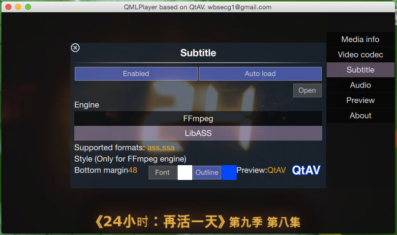
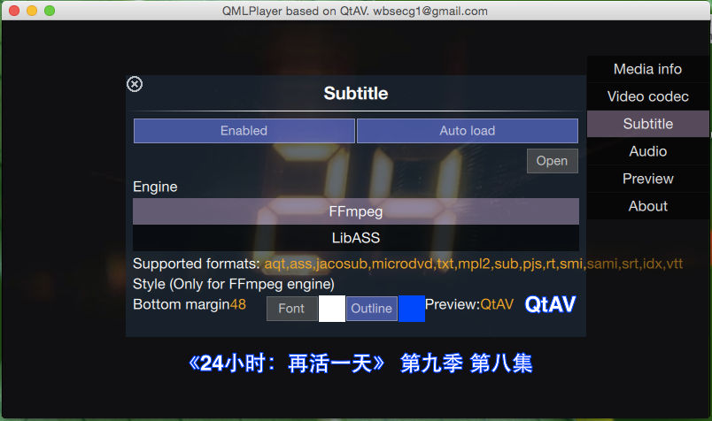
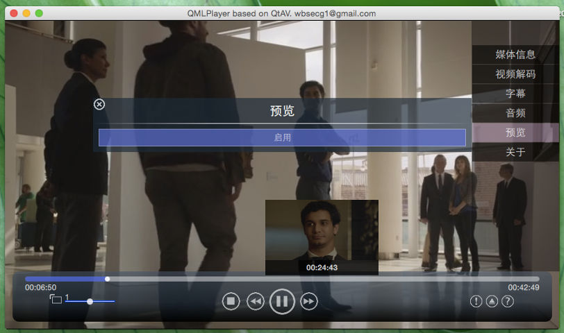
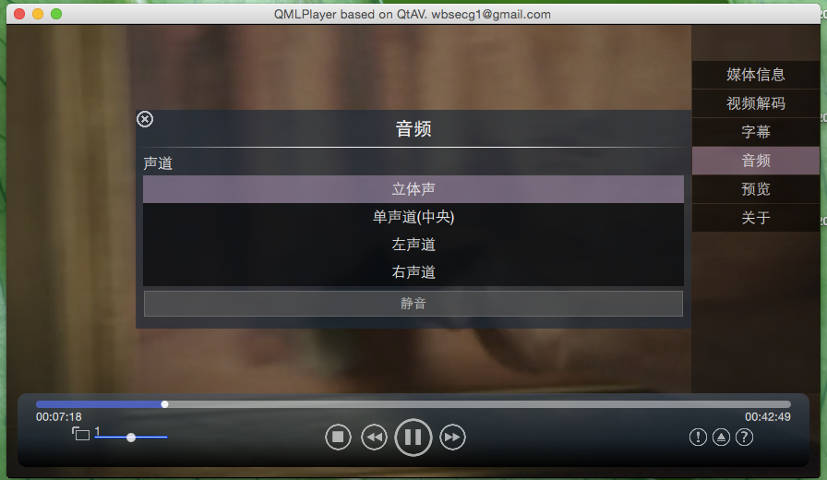
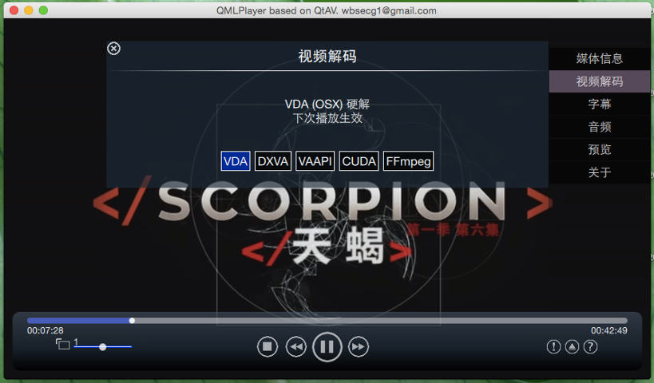
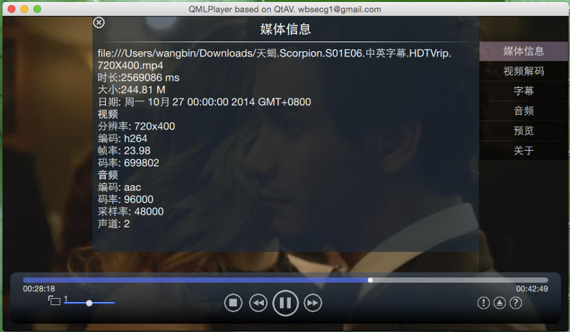

## 1.4.1 Release Note

### Changelog

- More QtMultimedia compatible QML playback API
- Debian package support. Now you can build on ubuntu>=14.04 using debuild
- Subtitle: libass renderering support. Dynamically change FFmpeg parser and libass
- Log level control support without changing any Qt logging functions (qDebug, qWarning etc.)
- Video orientation support in renderers
- Bug fix: video frame with alpha value. video stream start time >0. OpenAL can not close correctly...
- QML only: video preview.
- players: config UI in QMLPlayer. Video preview on progress bar.

### QML API

QML API is plan to compatible with QtMultimedia module. Here is a list of unsupported API
- MediaPlayer: autoLoad, avaibility, bufferProgress, status.

### Subtitle

libass is supported now. You can use `subtitleFilter->setEngines(QStringList() << "LibASS" << "FFmpeg")` to enable libass renderering if possible. In QML

    Video {
        ...
        subtitle.engines: ["LibASS", "FFmpeg"]
    }

It will take effect soon even if video is playing.

### Screenshort

