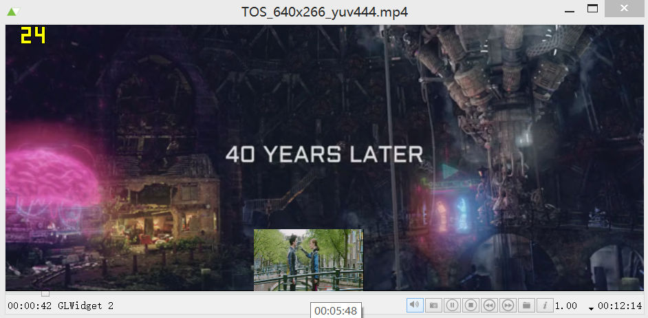

## 1.5.0 Release Note

### Changelog
- Add QtAVWidgets module contains widget based renderers, video preview widget
- QtAV module only depends on QtCore and QtGui
- Improve audio output API
- Simplify deployment on OSX. Deploy sdk from release packages without build.
- Improve seekable detection
- Fix noise audio if volume increased
- Fix noise and wrong playback speed for wmv videos
- Preview is more accurate
- Do not copy AVPacket but use reference count.
- Faster audio track switch
- Reopen audio output only if audio format changed
- VideoFrame: new API for converting to another format or QImage
- OpenGL VAO, VBO support.
- QML
  * Fix some crashes in QQuickItemRenderer
  * Add FBO item renderer and use the same code path as other opengl renderers
  * timeout property
- player and QMLPlayer example
  * player: real time preview on progress bar
  * Fast seek and display if seek shortcut is pressed and hold

### QtAVWidgets Module

All classes depedns on QtWidgets module are moved to QtAVWidgets module. Thus your QtWidgets is not required for your QtQuick app. For C++ developers, code changes a little

- In `pro` file, add a line `QT += avwidgets`
- In source files use QtAV or it's renderers, add

    #include <QtAV>
    #include <QtAVWidgets>

- In main.cpp, call `QtAV::Widgets::registerRenderers();`

### Real Time Preview

It was already used in QML module (and QMLPlayer) in previous release. Now it is also included in QtAVWidgets module and player example.

    VideoPreviewWidget *preview = new VideoPreviewWidget();
    preview->resize(160, 90);
    preview->setFile("path_of_video");
    ...
    // slot of slider value changed
    preview->setTimestamp(value);
    preview->preview();

screenshots:

### QML Video

QML `VideoOutput` item crashes a lot since OpenGL rendering was enabled in previous releases. Now most crashes are fixed, but 1 crash still exists(VideoFrame assignment). As a workaround, I add a new QML item `VideoOutput2`, which is `QuickFBORenderer` in C++. New renderer use the same OpenGL code path as renderers in QtAV and QtAVWidgets. It's easier to maintain. It works fine. One limitation I know is that it's parent items can not set `layer.enabled: true`. Otherwise `VideoOutput2` will not update correctly. I don't know what is the solution. Tell me if you know.

To use `VideoOutput2` and `Video` item you have to `import QtAV 1.5`.

### Deploy QtAV SDK on OSX

Download the latest OSX player dmg, install player.app to `/Applications`. Run

    /Applications/player.app/sdk_osx.sh ~/Qt5.4.0/5.4/clang_64/lib

Assume your Qt5.4 is installed in ~/Qt5.4.0.

Now you can test your first QtAV app. Change QtAV/examples/simpleplayer/simpleplayer.pro content to

    TEMPLATE = app
    CONFIG -= app_bundle
    QT += avwidgets av
    HEADERS = playerwindow.h
    SOURCES = playerwindow.cpp main.cpp

Open simpleplayer.pro in QtCreator, build and run.

##### About Released Binary Packages
https://sourceforge.net/projects/qtav/files/release/1.5.0
