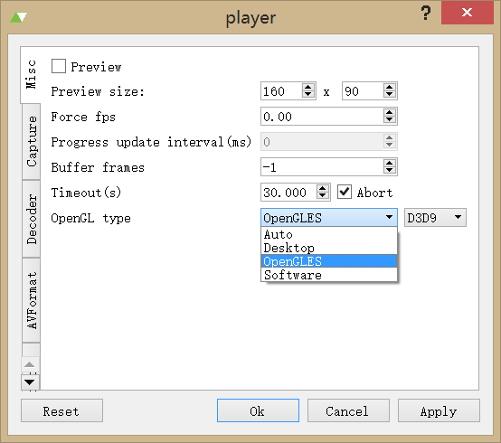
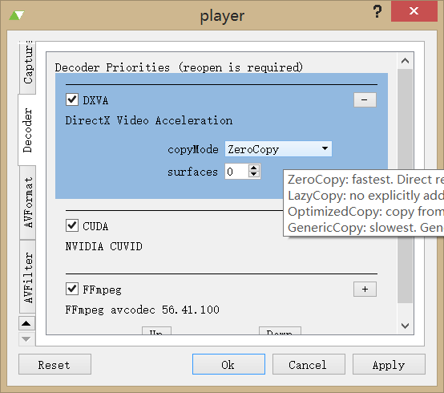

## 1.7.0 Release Note

### Changelog
- DXVA GPU zero-copy support
- DXVA copy-back mode improvement
- VAAPI zero-copy improvement 
- Fix opengl wrong display if switch decoder between VDA and FFmpeg
- Video encoding support
- External audio track support
- Pulseaudio improvement, fix crashes and hang
- OpenGL: disable VBO for ANGLE to workaround qpainter filters have no effect. Less GL calls. Fix OpenGLWindowRenderer can not update correctly
- Fix capture video when a zero-copy HW decoder is used.
- Fix wrong audio data is played at the beginning of playback
- Enable XV shm
- Improve a/v sync
- Build android on windows
- Fix msvc debug build
- Use OpenSL ES as for android. It works correctly now. No OpenAL required any more. Add volume control for OpenSL ES.
- Fix crashes
- Add ubuntu PPA: https://launchpad.net/~wbsecg1/+archive/ubuntu/qtav
- CI: appveyor for windows
- AVInput=>MediaIO. You can use it to support custom output when encoding video
- Add seekFinished, durationChanged, QML MediaPlayer.videoCapture, Subtitle delay etc
- QMLPlayer: swipe to seek

### DXVA 0-Copy

Before this version QtAV does not support zero-copy for DXVA. The decoded data must be read back from GPU and it wastes a lot of cpu time. Now the renderer can directly render the picture on GPU. The CPU load can be very low.

ANGLE (OpenGL ES2) is required to support 0-copy. Since Qt5.4, Qt supports dynamic OpenGL. Desktop OpenGL will be used if it's available. There are 2 ways to enable OpenGL ES:

- `qApp->setAttribute(Qt::AA_UseOpenGLES);` at the beginning
- set environment `QT_OPENGL=angle`

If OpenGL ES is used, 0-copy mode will be used for DXVA decoder in QtAV. You can force copy-back mode like this

    QVariantHash dec_opt(player->optionsForVideoCodec());
    dec_opt["copyMode"] = "OptimizedCopy"; // or "GenericCopy"
    player->setOptionsForVideoCodec(dec_opt);

The QMLPlayer example use OpenGL ES by default, You have to edit `%HOME%\.QtAV\QMLPlayer.ini` to change opengl.

The player example has a gui option to choose OpenGL ES or Desktop OpenGL
 

NOTE: git submode `capi` is required to build with 0-copy support

##### Desktop OpenGL + DXVA 0-copy

A WGL extension is required. https://www.opengl.org/registry/specs/NV/DX_interop.txt

I wrote the code but it and test for several GPUs. Only Intel HD4600 works.

### Video Encoding

Video encoding support is still working in progress. Currently you can transcode video streams but not audio stream.

Try examples/simpletranscode. 

### CI

I use appveyor for windows build. When I push a commit to github, appveyor will build it and create a package. It's very helpful to watch the build issue. You can download the latest build from
https://ci.appveyor.com/project/wang-bin/qtav/build/artifacts
 or https://sourceforge.net/projects/qtav/files/ci/