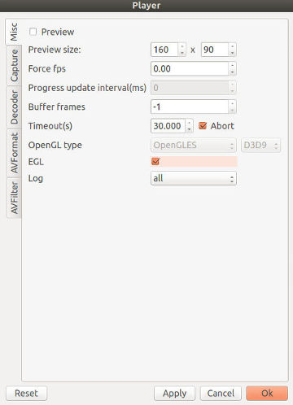
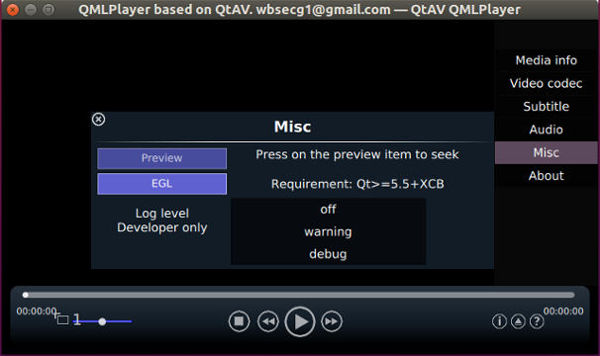

## 1.9.0 Release Note

### Changelog
- No audio thread if audio stream < 0. null AudioOutput now still create audio thread.
- VideoOutput: fix lock error
- Filter: add X11 text rendering for X11Renderer/XVRenderer.
- LibAVFilter supports HW frames(not recommended)
- VideoFrame copy and init issue, bpp compute error
- Avoid using some stl APIs that breaks ABI
- Add x11 renderer
- XV: support NV12 and packed yuv formats
- Fix factory initialization for static build(iOS for example)
- Fix ffmpeg log level
- Remove AVPicture which is deprecated
- SWS 16 alignment, output to user defined buffer
- Always define the registered id so we can use everywhere
- Better iOS support: build, run, deploy(prl)
- use libuchardet now, use system one if possible
- Fix android build on windows
- XAudio2: fix crash. `double` sample format is not supported
- Fix clock value if speed changed
- VideoRenderer.updateUi
- VideoCapture: fix HW frame save
- New logo 
- Android: support protocol 'content'. Now can play from Gallery.
- MediaIO is not writable by default
- WinRT (Windows Store) support:
 * Link to XAudio2
 * File open and protocol
- VA-API:
 * Add hevc, vp9. Not tested
 * Support more profiles
 * Improve nvidia support
 * Interop with egl support(dma, tfp). libva 0.38 and Qt>=5.5 are required.
 * Check resolution support before open
 * Add thread count option (new ffmpeg >2.8 does not support)
 * Prefer /dev/dri/renderD128 for drm
 * Correctly release X11/drm resource
- OpenGL:
 * OpenGL ES3 optimization
 * use new OpenGL and GLSL APIs if possible
- CI:
 * Add windows. Build with latest Qt release. Using msbuild, nmake and mingw32-make
- API:
 * AVPlayer.stepForward(), stepBackword(). playNextFrame() is deprecated
 * AVPlayer.state
 * AVPlayer.videoDecoderPriority with name list
 * VideoRenderer.frameSize (C++), VideoOutput.frameSize
 * XXXDecoder/Encoder::supportedCodecs, AV(De)Muxer.supportedFormats/Extensions
 * QML: more metaData keys: startTime, sampleFormat, channelLayout, pixelFormat, videoFrames
- QMLPlayer/Player:
 * fix OpenGLWidgetRenderer crash
 * Handle Home/Back button for mobile
 * Preview item is movable
 * ppa: rename /usr/bin/player to /usr/bin/Player

### Windows Store Support

I have submitted QMLPlayer to windows store. If you are using windows >=8.1 x64 or windows phone >= 8.1, you can search QtAV in the store and have a try.

I added a patch for FFmpeg to support multithreading. It was merged to upstream [winrt: multithreading support](http://git.videolan.org/?p=ffmpeg.git;a=commit;h=0861862b897ade9e62064f532f3b0a957ee7a0d8). With this patch, ffmpeg performance is improved a lot.

[How to build FFmpeg for windows store](https://github.com/wang-bin/build_ffmpeg/wiki#windows-store)
[How to deploy QtAV apps for windows store](https://github.com/wang-bin/QtAV/wiki/Deploy-for-WinRT)

### VA-API + EGL

va-api version 0.38 and egl extension `EGL_EXT_image_dma_buf_import` are required to enable zero copy. Then va-api decoding and OpenGL rendering can get the best performance. It works for display `X11` and `DRM`. You can try it on ubuntu 15.10.

Maybe only intel GPU is supported. NVIDIA drivers lack of the required EGL extension. AMD is not tested.

Since Qt5.5, Qt app can run with EGL instead of GLX, using the environment var `QT_XCB_GL_INTEGRATION=xcb_egl`. There is an `EGL` option the player/QMLPlayer setup page, check it and restart.

