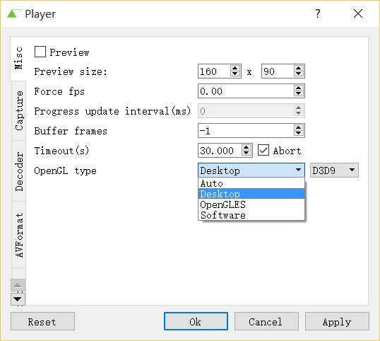
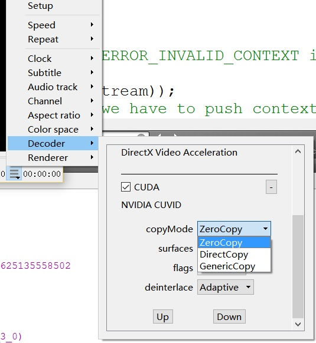
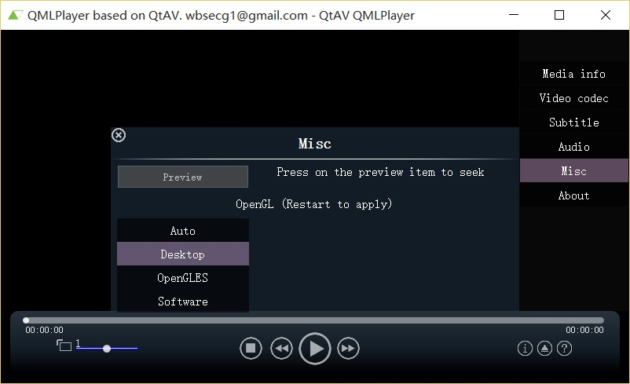
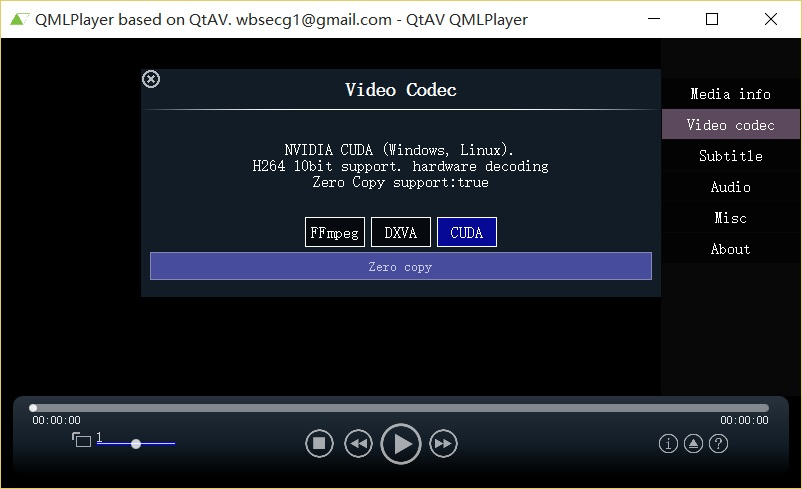

#CUDA Decoder With Zero Copy Rendering

CUDA supports interoperation with graphic APIs such as OpenGL and D3D. NVIDIA also provides some examples to show I it works, including device to host copy and zero  copy(device to device only). Obviously copying from device to host and uploading again for rendering will hit the performance. But all the zero copy examples relys on a CUDA kernel to convert the NV12 to RGB. The result is we have to use nvcc compiler to build the code and our build environment will be complicate(CUDA7 supports live compiler) and sometimes is impossible(I use CUDA driver APIs to build CUDA enabled code for all platforms in any build environment).

Is there any solution to enable zero copy with only graphic APIs? My answer is yes. I have the idea about 1 year ago and now I make it real! The source code can be found in QtAV project https://github.com/wang-bin/QtAV/blob/master/src/codec/video/SurfaceInteropCUDA.cpp

## CUDA + OpenGL

The decoded data is in NV12 format. Because It's possible to render NV12 using OpenGL with 2 textures(1 per plane), so we can directly use the NV12 data from CUDA for OpenGL, then use OpenGL shaders to render.  

- Register OpenGL Textures as CUDA resources

    `CUresult cuGraphicsGLRegisterImage(CUgraphicsResource *pCudaResource, GLuint image, GLenum target, unsigned int Flags);`

Registering once is enough unless the textures are changed.

- Get CUDA Accessible Handles for OpenGL Textures

    CUresult cuGraphicsMapResources(unsigned int count, CUgraphicsResource *resources, CUstream hStream);
    CUresult cuGraphicsSubResourceGetMappedArray(CUarray *pArray, CUgraphicsResource resource, unsigned int arrayIndex, unsigned int mipLevel);

Map the resource before we use it. Then we can get a mapped CUarray object which represents the OpenGL texture data. If we fill this array with data from an NV12 plane, the texture then has the correct plane data and is ready for rendering.

Unmapping the resource immediately is OK in my test. DO NOT forget to unmap the resource. Mapping an already mapped resource may crash your program.

    CUresult cuGraphicsUnmapResources(unsigned int count, CUgraphicsResource *resources, CUstream hStream);

- NV12 Device to Device Copy

The decoded data in CUDA is a CUdeviceptr. To fill the mapped OpenGL texture, we can use 

    CUresult cuMemcpy2D(const CUDA_MEMCPY2D *pCopy);

The copy only happens on GPU and It's fast.

    CUDA_MEMCPY2D cu2d;
    memset(&cu2d, 0, sizeof(cu2d));
    cu2d.srcDevice = devptr;
    cu2d.srcMemoryType = CU_MEMORYTYPE_DEVICE;
    cu2d.srcPitch = pitch;
    cu2d.dstArray = array;
    cu2d.dstMemoryType = CU_MEMORYTYPE_ARRAY;
    cu2d.dstPitch = pitch;
    // the whole size or copy size?
    cu2d.WidthInBytes = pitch;
    cu2d.Height = h;
    if (plane == 1) {
        cu2d.srcXInBytes = 0;// +srcY*srcPitch + srcXInBytes
        cu2d.srcY = H; // skip the padding height
        cu2d.Height /= 2;
    }
    CUDA_ENSURE(cuMemcpy2D(&cu2d), false);

Now the textures are filled with NV12 data from each plane.

- Render With OpenGL
- Unregister CUDA Resource

    `CUresult cuGraphicsUnregisterResource(CUgraphicsResource resource);`

## CUDA + D3D

D3D9 as an example.

It's similar with OpenGL. First you have to register D3D9 resouces to CUDA

    CUresult cuD3D9CtxCreate(CUcontext *pCtx, CUdevice *pCudaDevice, unsigned int Flags, IDirect3DDevice9 *pD3DDevice);
    CUresult cuGraphicsD3D9RegisterResource(CUgraphicsResource *pCudaResource, IDirect3DResource9 *pD3DResource, unsigned int Flags);

D3D can create an NV12 texture directly, but unfortunatly CUDA can not register a this kind of texture as a CUDA resource. The supported formats can be found in cudaD3D9.h. So I use 1 L8 texture for the whole NV12 data(or 2 textures like OpenGL). Copying the decoded NV12 data to d3d texture is similar to OpenGL. Then we can use a pixel shader to convert the texture to RGB format and store it in another d3d texture. Because I'm not familar with D3D and HLSL now, I have not tested it. Currently I simply use memcpy to copy L8 texture to an NV12 surface and then use `StrechRect` to convert to an RGB surface. The performance is still better than Device=>Host.

## CUDA + ANGLE

ANGLE is OpenGL ES 2.0/3.x implementation on top of Direct3D 9/11. We have to use 2 kinds of interoperations: CUDA+D3D and D3D+EGL/OpenGL ES2.

## How to Run

You must run your program with NVIDIA GPU. If you have both intel and nvidia, intel's opengl or d3d may be used and the ineroperation will be failed. You can try the latest QtAV build from https://sourceforge.net/projects/qtav/files/ci/ or https://ci.appveyor.com/project/wang-bin/qtav/build/artifacts

screenshots: set desktop opengl mode and CUDA zero copy

 

> Wang Bin, Aug 2015